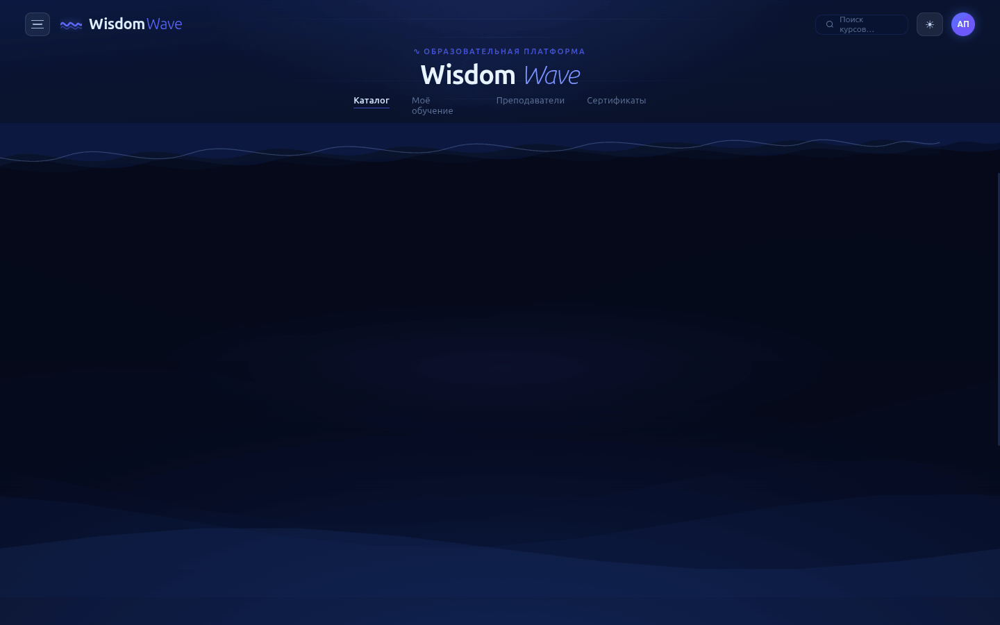
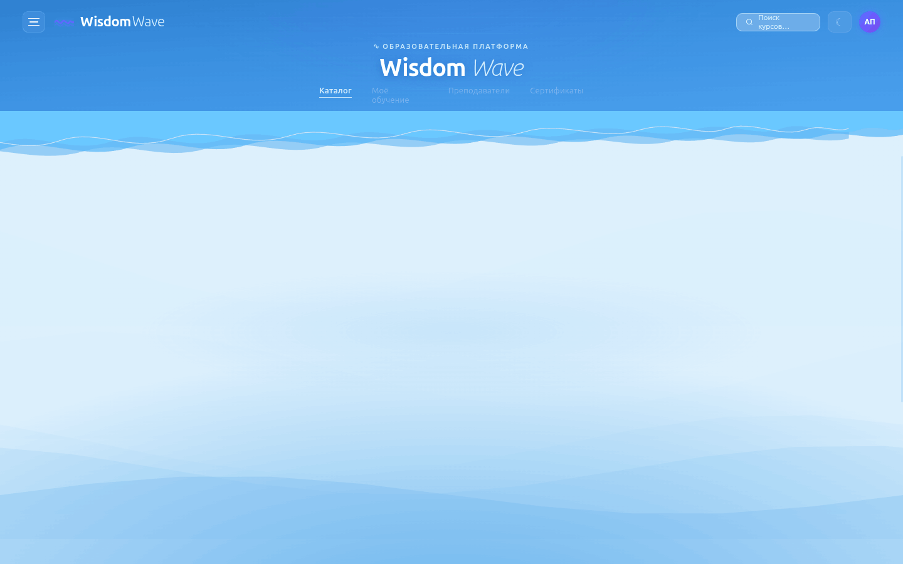
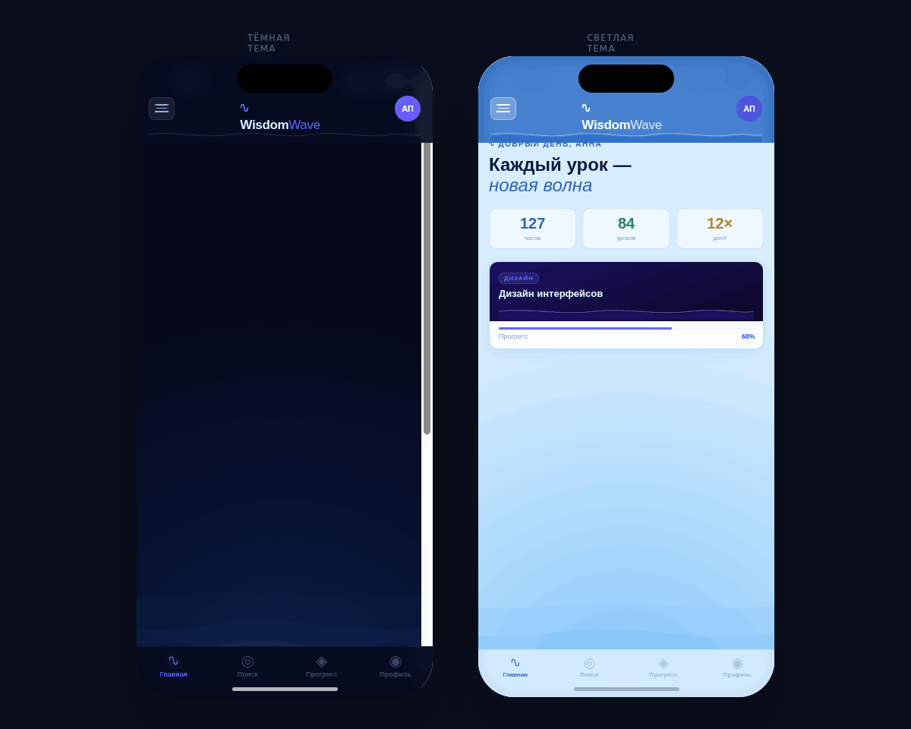

# 🌊 Wisdom Wave — Образовательная платформа

Интерактивный прототип образовательной платформы с волновой визуальной стилистикой. Построен на React + Babel, без сборщиков — открывается прямо в браузере.

---

## Превью

### Desktop — Тёмная тема (главная)


### Desktop — Тёмная тема (курс)


### Desktop — Светлая тема


### Desktop — Боковое меню (гамбургер)


### Mobile — Тёмная и светлая темы


---

## Файлы

| Файл | Описание |
|------|----------|
| `Educational Platform.html` | Десктопная версия |
| `Wisdom Wave Mobile.html` | Мобильный превью в iOS-фрейме |
| `ios-frame.jsx` | Компонент iOS-устройства |
| `screenshots/` | Скриншоты всех вариантов |

---

## Возможности

### 🌊 Волновая стилистика
- Анимированный многослойный океанский фон (5 слоёв волн)
- Ветровые потоки — тонкие прозрачные нити
- Карточки-волны: гребень = название курса, тело волны = данные
- SVG-волны с пеной и светящимися пузырьками

### 📱 Экраны
- **Главная** — персональный дашборд, статистика, каталог курсов
- **Курс** — детальная страница, программа, преподаватель
- **Урок** — видеоплеер с волновым прогрессом, список глав

### 🎛 Интерфейс
- **Гамбургер-меню** — все курсы с прогрессом, форум, связь с наставником
- **Переключатель тем** ☀/☾ — тёмный океан / дневная лазурь
- **Tweaks-панель** — смена акцентного цвета и глубины фона
- Сохранение позиции и темы в `localStorage`

### 📱 Мобильная версия
- iOS 26 Dynamic Island фрейм
- Нижняя навигация
- Боковое меню с наставником
- Оба телефона рядом: тёмная + светлая тема

---

## Стек

```
React 18 + Babel (CDN, без сборки)
CSS Custom Properties
SVG анимации
Google Fonts — Outfit
```

---

## Запуск

Просто откройте `Educational Platform.html` в браузере — никакой установки не требуется.

```bash
open "Educational Platform.html"
# или
python3 -m http.server 8080
```
